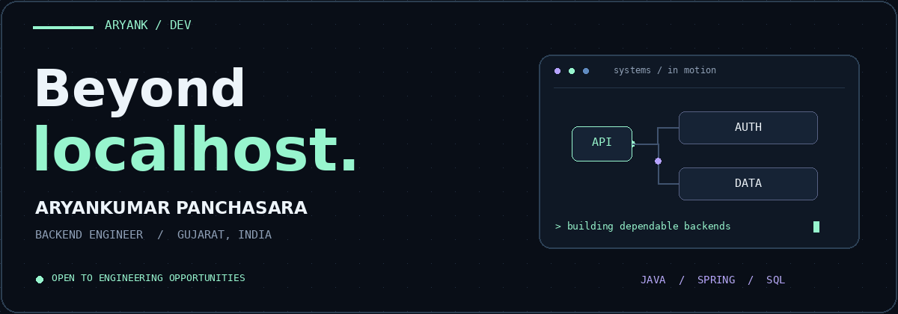
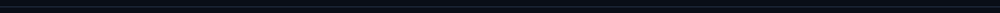
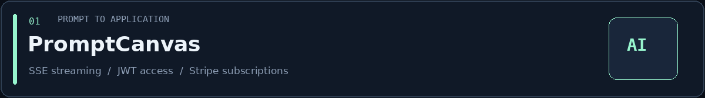
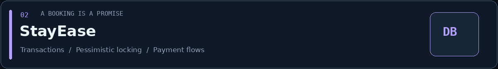
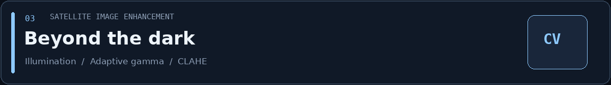

<!-- Upload this README and the assets folder together to dev-aryank/dev-aryank. -->

  &nbsp;
  &nbsp;
  &nbsp;
  

<table>
<tr>
<td width="24%" align="center">
  
</td>
<td width="76%">
  <h3>Hey, I'm Aryan.</h3>
  <strong>I build the part of software users rarely see—and everything else depends on.</strong>  
  APIs. Authentication. Databases. I'm interested in what happens when requests overlap, data grows, and a dependency fails.  
  <code>Backend engineering</code> <code>Distributed systems</code> <code>AI-powered backends</code>  
  B.Tech · ICT · Dhirubhai Ambani University (formerly DA-IICT) · 2026
</td>
</tr>
</table>

### ⚡ Things I've built

### 🧩 The tools behind the work

**Build** &nbsp; Spring Security · JPA / Hibernate · REST APIs · MinIO 
**Verify** &nbsp; JUnit 5 · Mockito · Testcontainers · Postman · OpenAPI

<table>
<tr>
<td width="50%">
<strong>↗ Expanding beyond the JVM</strong>  
Learning TypeScript, Node.js and Express. Exploring NestJS and its architecture.
</td>
<td width="50%">
<strong>✦ Exploring AI engineering</strong>  
RAG · Agents · Multi-agent orchestration LLM evaluation · Observability
</td>
</tr>
</table>

  <strong>Let's build something that survives more than localhost.</strong>  
  <a href="mailto:hello@aryank.dev">hello@aryank.dev</a> &nbsp; / &nbsp; <a href="https://aryank.dev/">aryank.dev ↗</a> 
  Open to Backend Engineering &amp; Software Engineering opportunities.

