<div align="center">



<br />

<a href="https://github.com/dev-aryank?tab=followers"></a>
<a href="https://github.com/dev-aryank?tab=repositories"></a>


</div>

## `$ whoami`

```yaml
name: Aryankumar Panchasara
education: B.Tech in Information and Communication Technology
university: Dhirubhai Ambani University (formerly DA-IICT)
focus:
  - Backend engineering
  - Systems programming
  - Computer vision
currently_building: production-minded software from protocol bytes to payment flows
engineering_style: curious, practical, and obsessed with understanding what happens underneath
```

I enjoy projects where the interesting work lives below the surface: preventing an overbooked room under concurrent requests, following a TLS packet far enough to identify its destination, designing a tiny query engine, or recovering structure from an image that looks almost black.

My repositories move across **Java**, **C++**, and **Python**, but the theme stays consistent: build the fundamentals, make the architecture understandable, and turn theory into software that actually runs.

<br />

## What I’m exploring

<table>
<tr>
<td width="50%" valign="top">

### 🏗️ Reliable backends

Layered services, clean APIs, authentication, payments, database concurrency, scheduled jobs, and business rules that remain correct when real users arrive.

</td>
<td width="50%" valign="top">

### ⚙️ Systems from first principles

Packet parsing, flow tracking, multithreading, persistent storage, command parsing, and the low-level mechanics hidden behind familiar abstractions.

</td>
</tr>
<tr>
<td width="50%" valign="top">

### 🛰️ Visual computing

Interpretable image enhancement with illumination models, Retinex reconstruction, saliency, contrast weighting, and multi-scale fusion.

</td>
<td width="50%" valign="top">

### 🧠 Architecture that teaches

Readable code, explicit trade-offs, helpful diagrams, and documentation that explains not only *what* the system does, but *why* it is shaped that way.

</td>
</tr>
</table>

## Featured builds

### 🏨 [StayEase Backend](https://github.com/dev-aryank/stayease-backend)

> A production-minded hotel booking backend built around the hard parts of reservations—not just CRUD.

- **Java 21 + Spring Boot** layered architecture with PostgreSQL persistence
- JWT access tokens, HttpOnly refresh cookies, BCrypt, and role-based authorization
- Date-wise inventory with **pessimistic locking** to protect against overbooking
- Composable dynamic pricing using the **Decorator Pattern**
- Stripe Checkout, webhook confirmation, cancellation, and refund flows
- Scheduled price recalculation, reporting, Swagger/OpenAPI, and centralized error handling

`Java` `Spring Boot` `Spring Security` `PostgreSQL` `Stripe` `JPA/Hibernate` `Maven`

---

### 🌐 [High-performance DPI Engine](https://github.com/dev-aryank/dpi-engine-cpp)

> A C++17 deep packet inspection engine that reads real PCAP traffic and makes flow-aware filtering decisions.

- Parses Ethernet, IPv4, TCP, and UDP packets without hiding the protocol details
- Extracts TLS SNI and HTTP Host information for application classification
- Tracks bidirectional flows with normalized five-tuples
- Uses a multi-threaded load-balancer / fast-path architecture
- Supports IP, application, and domain-based blocking rules

`C++17` `Networking` `PCAP` `TLS/SNI` `Multithreading` `CMake`

---

### 🌌 [Satellite Dark Image Enhancement](https://github.com/dev-aryank/satellite-dark-image-enhancement)

> An interpretable, non-deep-learning pipeline for recovering detail in extremely low-light satellite and aerial imagery.

- Generates multiple illumination interpretations and fuses them perceptually
- Combines luminance, contrast, and saliency weight maps
- Uses Gaussian/Laplacian pyramids, gamma correction, CLAHE, and Retinex reconstruction
- Adds white balancing, controlled denoising, sharpening, and satellite-specific tuning

`Python` `OpenCV` `NumPy` `Retinex` `Image Processing` `Multi-scale Fusion`

---

### 💾 [Custom C++ Database](https://github.com/dev-aryank/custom-db-cpp)

> A compact CLI database engine created to understand what sits behind a query prompt.

- Custom schemas and SQL-like `CREATE`, `INSERT`, `SELECT`, `UPDATE`, and `DELETE`
- Conditional filtering with persistent JSON-backed storage
- Interactive command parsing and tabular results
- A deliberately small design that leaves room for indexes, joins, and concurrency

`C++17` `Database Internals` `Command Parsing` `JSON` `Persistence`

<br />

## Live project radar

This section is generated from the GitHub API. It follows my most recently pushed public, non-fork repositories and refreshes automatically.

<!-- AUTO:PROJECTS:START -->
| Project | What it is | Stack | Last push |
|:--|:--|:--:|:--:|
| [promptcanvas](https://github.com/dev-aryank/promptcanvas) | Distributed AI app builder with Spring Boot, inspired by Lovable and Bolt. Generate, modify, execute, and preview apps using natural-language prompts. | `Java` | 20 Aug 2026 |
| [stayease-backend](https://github.com/dev-aryank/stayease-backend) | Production-ready Spring Boot backend for a hotel booking platform featuring hotel management, bookings, inventory, authentication, payments, and dy… | `Java` | 16 Aug 2026 |
| [custom-db-cpp](https://github.com/dev-aryank/custom-db-cpp) | A lightweight CLI-based database engine in C++ with JSON-based persistent storage, supporting SQL-like operations such as CREATE, INSERT, SELECT, U… | `C++` | 29 Apr 2026 |
| [satellite-dark-image-enhancement](https://github.com/dev-aryank/satellite-dark-image-enhancement) | A classical (non-deep learning) pipeline for enhancing low-light satellite and aerial images using multi-illumination fusion, contrast-saliency wei… | `Python` | 28 Apr 2026 |
| [dpi-engine-cpp](https://github.com/dev-aryank/dpi-engine-cpp) | High-performance Deep Packet Inspection engine in C++ with multi-threaded architecture, SNI extraction, and rule-based traffic filtering. | `C++` | 28 Apr 2026 |
<!-- AUTO:PROJECTS:END -->

<br />

## Toolbox

<div align="center">


</div>

| Layer | Technologies & ideas |
|:--|:--|
| **Languages** | Java · C++ · Python · JavaScript |
| **Backend** | Spring Boot · Spring MVC · Spring Security · REST APIs · JWT · Stripe |
| **Data** | PostgreSQL · Spring Data JPA · Hibernate · JSON persistence |
| **Systems** | Multithreading · packet parsing · flow tracking · producer/consumer queues · CMake |
| **Vision** | OpenCV · NumPy · Retinex · CLAHE · pyramid fusion · classical CV |
| **Engineering** | Git · Maven · OpenAPI/Swagger · design patterns · clean architecture |

<br />

## Engineering principles I’m growing into

```text
01. Correctness before cleverness.
02. Understand the abstraction—then decide whether to use it.
03. Make concurrency explicit; race conditions do not respect demos.
04. Keep business rules testable and infrastructure replaceable.
05. Good documentation is part of the system, not decoration around it.
06. Build small versions of big ideas. That is how the internals become intuitive.
```

<br />

## GitHub in motion

<div align="center">

<picture>
  <source media="(prefers-color-scheme: dark)" srcset="https://github-profile-summary-cards.vercel.app/api/cards/stats?username=dev-aryank&theme=github_dark" />
  <source media="(prefers-color-scheme: light)" srcset="https://github-profile-summary-cards.vercel.app/api/cards/stats?username=dev-aryank&theme=github" />
  
</picture>
<picture>
  <source media="(prefers-color-scheme: dark)" srcset="https://github-profile-summary-cards.vercel.app/api/cards/repos-per-language?username=dev-aryank&theme=github_dark" />
  <source media="(prefers-color-scheme: light)" srcset="https://github-profile-summary-cards.vercel.app/api/cards/repos-per-language?username=dev-aryank&theme=github" />
  
</picture>

<br />

<picture>
  <source media="(prefers-color-scheme: dark)" srcset="https://github-readme-activity-graph.vercel.app/graph?username=dev-aryank&bg_color=0D1117&color=C9D1D9&line=8B5CF6&point=00D9FF&area=true&area_color=6D28D9&hide_border=true" />
  <source media="(prefers-color-scheme: light)" srcset="https://github-readme-activity-graph.vercel.app/graph?username=dev-aryank&bg_color=FFFFFF&color=24292F&line=7C3AED&point=0284C7&area=true&area_color=C4B5FD&hide_border=true" />
  
</picture>

</div>

## Recent activity

<!-- AUTO:ACTIVITY:START -->
- **19 Aug 2026** — pushed 1 commit to [dev-aryank/promptcanvas](https://github.com/dev-aryank/promptcanvas)
- **19 Aug 2026** — pushed 1 commit to [dev-aryank/promptcanvas](https://github.com/dev-aryank/promptcanvas)
- **19 Aug 2026** — pushed 1 commit to [dev-aryank/promptcanvas](https://github.com/dev-aryank/promptcanvas)
- **18 Aug 2026** — pushed 1 commit to [dev-aryank/promptcanvas](https://github.com/dev-aryank/promptcanvas)
- **17 Aug 2026** — pushed 1 commit to [dev-aryank/promptcanvas](https://github.com/dev-aryank/promptcanvas)
- **17 Aug 2026** — pushed 1 commit to [dev-aryank/promptcanvas](https://github.com/dev-aryank/promptcanvas)
- **17 Aug 2026** — created branch in [dev-aryank/promptcanvas](https://github.com/dev-aryank/promptcanvas)
- **16 Aug 2026** — pushed 1 commit to [dev-aryank/dev-aryank](https://github.com/dev-aryank/dev-aryank)
<!-- AUTO:ACTIVITY:END -->

<br />

## Contributions, but make them move

<div align="center">

<picture>
  <source media="(prefers-color-scheme: dark)" srcset="https://raw.githubusercontent.com/dev-aryank/dev-aryank/output/github-contribution-grid-snake-dark.svg" />
  <source media="(prefers-color-scheme: light)" srcset="https://raw.githubusercontent.com/dev-aryank/dev-aryank/output/github-contribution-grid-snake.svg" />
  
</picture>

</div>

<br />

## Let’s build something thoughtful

I’m especially interested in work involving backend systems, performance, networking, databases, computer vision, or any project where understanding the internals matters as much as shipping the interface.

If one of my projects sparks an idea, the easiest way to start a conversation is to open an issue or discussion in the relevant repository.

<div align="center">

### From raw bytes to reliable services—keep learning, keep building. ⚡

<a href="https://github.com/dev-aryank"></a>

<sub>This profile refreshes from public GitHub activity through GitHub Actions.</sub>

</div>
